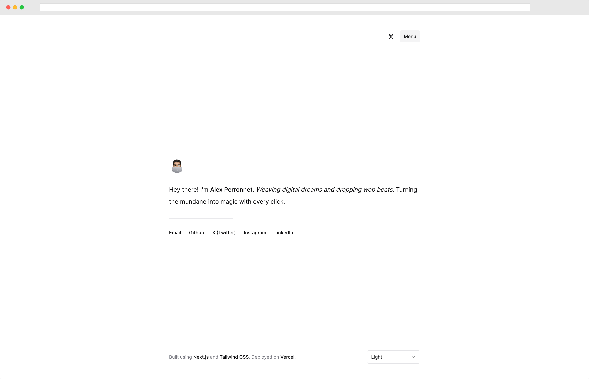

# lxprnt.me



Dive into the depths of my digital workshop! A curious blend of humor, professionalism, and that undeniable tech geek essence, this space encapsulates my footprints in the coding sand. Enjoy the tour, and maybe pick up a line or two of code while you're at it!

## 🛠 Toolbox

| Gadget          | Why I Use It                                                           |
| --------------- | ---------------------------------------------------------------------- |
| **Typescript**  | Keeping my code in check. After all, better safe than sorry!           |
| **Next.js**     | If JAMstack were a music genre, I'd have all its albums.               |
| **TailwindCSS** | Making things look sleek without breaking a sweat.                     |
| **Radix UI**    | My foundation. Everything starts from a good base, right?              |
| **CmdK**        | Efficiency in a press of keys. It's the future, today!                 |
| **Vercel**      | Where all my projects catch some Zs (and by Zs, I mean zero downtime). |

## 🚀 Get Up & Running

1. **Clone**: Get your hands on my digital blueprint:

   ```bash
   git clone https://github.com/alexperronnet/lxprnt.me.git
   ```

2. **Navigate**: Let's step inside, shall we?

   ```bash
   cd lxprnt.me
   ```

3. **Setup**: Equip yourself with the necessary tools:

   ```bash
    pnpm install
   ```

4. **Ignite**: Light it up and see the magic:

   ```bash
    pnpm dev
   ```

🖥️ Now, pop over to [localhost:3000](http://localhost:3000/). Enjoy the show!

## 📃 License

Yep, it's under the MIT License.

## 💡 Just a Thought

If this portfolio tickles your tech fancy and you're thinking of spinning something similar – go for it! All I ask is a little nod in my direction. Think of it as clapping for a DJ after a killer set. Cheers!
